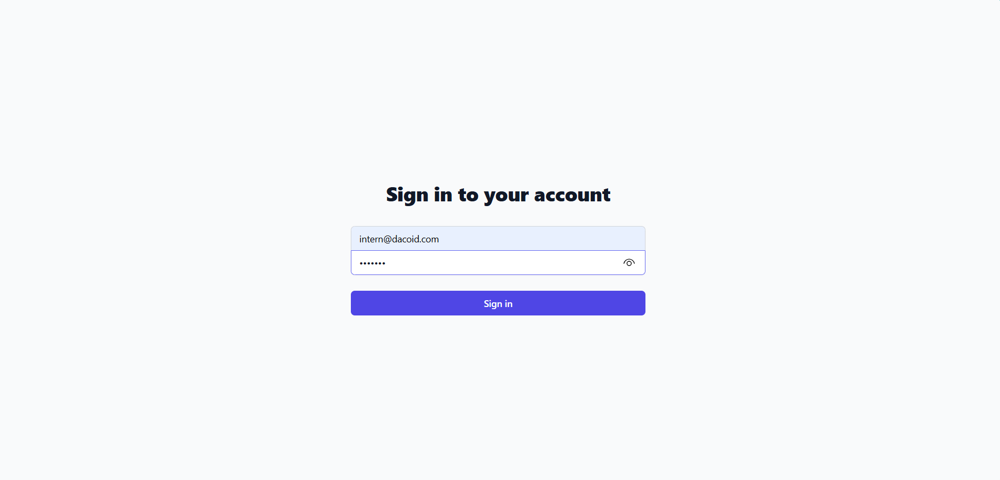
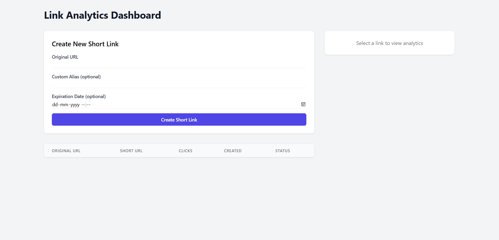
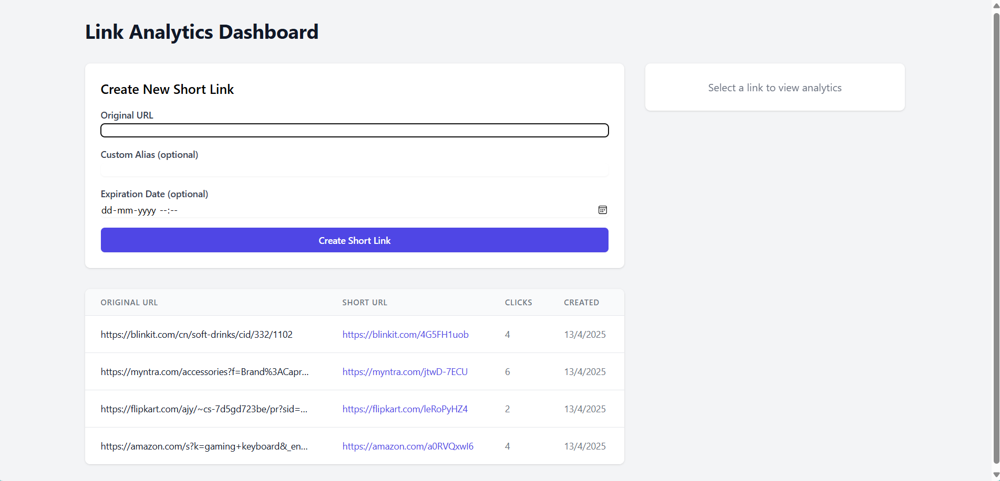
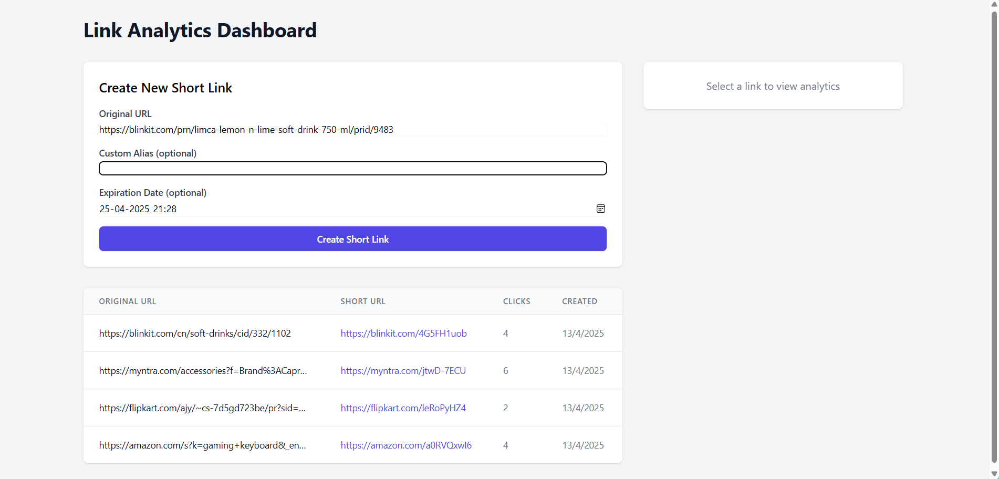
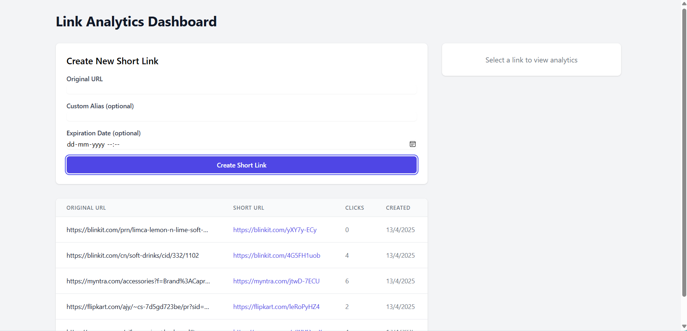

# Micro-SaaS-Link-Analytics-Dashboard

A full-stack URL shortener and analytics platform. Users can create shortened links, track performance, and view analytics such as click counts, devices, locations, and more.

FOR SIGN/LOGIN USE:
email: intern@dacoid.com
password: Test123

## Demo








## 🚀 Features

### ✅ Core Functionality
- **User Authentication** (JWT-based)
- **Short Link Creation** with:
  - Custom alias (optional)
  - Expiration date (optional)
- **Redirection** with click tracking
- **Analytics Dashboard**:
  - Click count
  - Expiration status
  - Devices + Browsers
  - Clicks over time (chart)
- **QR Code Generator** for each short link
- **Pagination + Search** for user's links

## 🛠 Tech Stack

### Frontend
- **React.js** + **Redux Toolkit**
- **TailwindCSS** for styling
- **Recharts** for analytics charts
- **Axios** for API requests

### Backend
- **Node.js + Express**
- **MongoDB** with **Mongoose**
- **JWT** for authentication
- **QRCode** for QR code generation
- **UA-Parser** for device detection


## Installation & Setup

### Prerequisites

Ensure you have the following installed:

- [Node.js](https://nodejs.org/en)

- [MongoDB](https://www.mongodb.com/)

### Clone the Repository

```bash
  git clone https://github.com/NikG100/Micro-SaaS-Link-Analytics-Dashboard.git
  cd Micro-SaaS-Link-Analytics-Dashboard
```

### Backend Setup

```bash
  cd backend
  npm install
  npm start
```

### Frontend Setup

```bash
  cd frontend
  npm install
  npm start
```

### Environment Variables

Create a `.env` file in the backend directory and configure:

```env
  PORT=5000
  MONGODB_URI=your_mongo_uri
  JWT_SECRET=your_secret 
```


    
